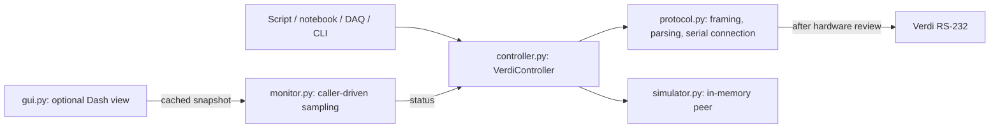

# Driver architecture

Eight modules, one synchronous device-control path:

| Module | Responsibility |
| --- | --- |
| `controller.py` | Public methods, status/diagnostic results, validation and one I/O lock |
| `protocol.py` | Manual query/value meanings, frame parsing, passive pySerial connection |
| `simulator.py` | Independent replies for the short-form commands emitted by the driver; fixtures |
| `monitor.py` | Optional synchronous sampling, bounded cache, freshness and JSON |
| `gui.py` | Optional read-only Dash client; no hardware handle or acquisition loop |
| `errors.py` | Four exceptions for communication, malformed data and device rejection |
| `__init__.py` | Twelve core exports; no optional-client imports |
| `__main__.py` | Simulator CLI; explicit polling-worker lifecycle for standalone GUI |

Follow `set_power_w()`: validate finite watts and ceiling, format `P=nn.nnnn`,
acquire the controller lock, encode one CR/LF frame, exchange it once, and decode
its acknowledgment. Reads use the same path and parse a catalogued value.
`status()` holds the lock across 14 sequential reads.

The only backend contract is `connect()`, `exchange(bytes) -> bytes`,
`disconnect()`, and `is_simulated`. This small structural typing declaration lets
an experiment stack supply a connection without inheritance, registration or
factories. A backend must bound I/O and must not be shared with another controller
or raw reader. Serial locking and failed-session state live once, in the controller.
The simulator separately locks mutable fixture state.

Construction does no I/O. Connect/disconnect send no device commands. A complete
device rejection leaves the session readable; uncertain I/O, interruption or
malformed data latches failure. No method clears that latch or replays state.
Disconnect remains available for cleanup, including cleanup retries.

The caller owns connection lifecycle and acquisition scheduling. Monitor and GUI
construction start no work. Monitor uses a sampling lock and a short cache lock
so rendering remains responsive during acquisition. The standalone GUI launcher
explicitly creates one worker and joins it before disconnecting. Core import
does not load serial, Dash, Plotly or monitoring.

Configuration objects, transport replacement, query-spec registry, telemetry
lifecycle machinery, serialization wrappers and old module aliases are removed.
Returned status/fault dataclasses and state enums remain to expose units and
hardware meanings. [AGENTS.md](AGENTS.md) retains engineering phase/authority rules;
[framework provenance](records/FRAMEWORK.md) retains template history.
Physical integration requires [candidate review](HARDWARE_VALIDATION.md).
