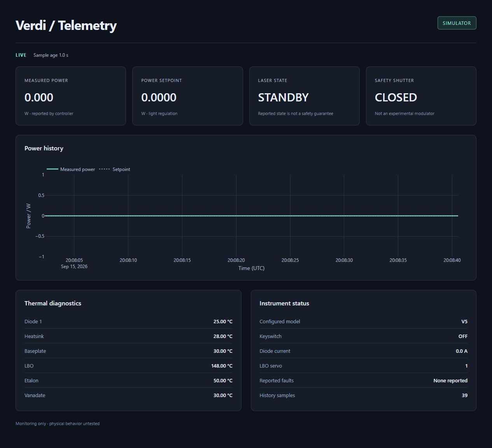
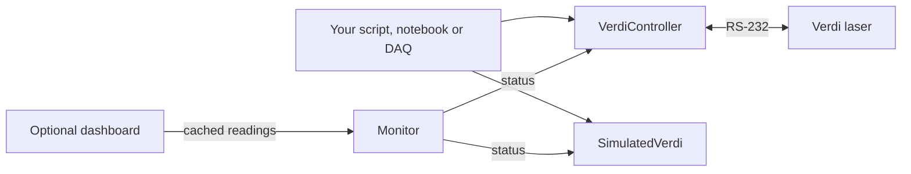

# Coherent Verdi Control

A small Python driver for **Coherent Verdi V-2, V-5 and V-6 lasers**. Read power,
inspect temperatures and faults, and control setpoints from your own script,
notebook or experiment-control system. Start with the built-in simulator; add
serial communication or the browser dashboard when you need them.

The core has no required dependencies and starts no background threads. Your
application decides when to connect, read, send commands and disconnect.

[Get started](#get-started-without-hardware) · [Open the GUI](#open-the-gui) ·
[Python API](docs/API.md) · [Tutorials](examples/tutorials/README.md)



*The optional dashboard running with the V5 simulator. These are synthetic
readings, not measurements from a laser. The steps below reproduce this view.*

**Current status:** software and simulator checks pass. Physical communication,
laser behavior and calibration still need [hardware validation](HARDWARE_VALIDATION.md).

## Get started without hardware

You need **Python 3.11 or later** and Git. In a terminal:

```sh
git clone https://github.com/cct1123/coherent-verdi-control.git
cd coherent-verdi-control
python -m venv .venv
```

Activate the environment on Windows PowerShell:

```powershell
.\.venv\Scripts\Activate.ps1
```

Or on macOS/Linux:

```sh
source .venv/bin/activate
```

Then install the driver and read the simulated instrument:

```sh
python -m pip install -e .
python -m coherent_verdi status
```

You should see JSON containing `"simulated": true`, `"power_w": 0.0`,
`"laser_state": 0` (standby), `"shutter_open": false` and `"faults": []`.
No laser, serial cable or serial configuration is needed.

## Open the GUI

In the same environment, install the optional dashboard and start it:

```sh
python -m pip install -e ".[gui]"
python -m coherent_verdi gui
```

Open **[http://127.0.0.1:8050](http://127.0.0.1:8050/)** in your browser. Keep
the terminal running; press **Ctrl+C** there to stop the server and its polling
worker. If that port is busy, use `python -m coherent_verdi gui --port 8051`
and open port 8051 instead.

| What you see | How to read it |
| --- | --- |
| **SIMULATOR** | Readings come from the in-memory device. |
| **LIVE** and sample age | The latest sample is fresh; this is not a laser-safety indication. |
| Measured power / power setpoint | Reported output versus the requested setting, both in watts. |
| Laser state / safety shutter | The latest reported standby/on/fault and open/closed states. |
| Power history | Recent readings and setpoints; failed samples appear as gaps. |
| Thermal diagnostics / instrument status | Temperatures, keyswitch, current, servo code and faults. |

**A flat 0 W trace is expected:** the CLI starts a fresh simulator in standby
with the shutter closed. The GUI is a monitoring view; commands are issued through
the Python API. All CLI commands use simulation, including `gui`.

## Use it from Python

Save this as `read_verdi.py` and run `python read_verdi.py` in the same environment:

```python
from coherent_verdi import SimulatedVerdi

with SimulatedVerdi("V5") as laser:
    print(f"Power: {laser.read_power_w():.3f} W")
    print(f"LBO temperature: {laser.read('?LBOT'):.2f} °C")
    print("Faults:", laser.read_faults())
```

Expected simulator output:

```text
Power: 0.000 W
LBO temperature: 148.00 °C
Faults: []
```

`with` connects on entry and disconnects on exit. You can also call `connect()`
and `disconnect()` explicitly. Readings are ordinary numbers, strings, lists
and dictionaries: `laser.status()["power_w"]` is a number in watts, and
`json.dumps(laser.status())` works with Python's standard `json` module.

To try a setpoint change **in simulation**, run this separate example:

```python
from coherent_verdi import SimulatedVerdi

with SimulatedVerdi("V5", allow_writes=True, power_limit_w=0.5) as laser:
    laser.set_power_w(0.25)
    print("Setpoint:", laser.read("?SP"), "W")  # 0.25 W
    print("Measured:", laser.read_power_w(), "W")  # 0.0 W: still in standby
```

Writes are disabled by default. The 0.5 W ceiling above is a simulator exercise
setting, not a safe operating limit for your lab. For a complete start, shutter
and standby sequence with readback checks, follow [tutorial 3](examples/tutorials/03_controlled_session.ipynb).

| Task | Public API |
| --- | --- |
| Manage the connection | `connect()`, `disconnect()` or `with` |
| Read the instrument | `read_power_w()`, `read_faults()`, `read("?…")` |
| Collect a status or diagnostic report | `status()`, `read_diagnostics()` |
| Set output power | `set_power_w(watts)` |
| Enable / enter standby | `start()`, `stop()` |
| Operate the safety shutter | `set_shutter(open=True)` / `set_shutter(open=False)` |

`start()` also resets faults and clears fault history. `stop()` enters standby;
temperature servos remain powered. **Disconnecting releases communication; it
does not shut down the laser.** See the [API reference](docs/API.md) for command
semantics, units and error handling.

## Fit it into your experiment

Choose `SimulatedVerdi` for development or `VerdiController` for an approved
hardware session. Both expose the same device operations:



Scripts and the monitor call the same public API; choose one controller for each
device session. Share that object among your clients. It serializes I/O, while your application
owns connection lifetime, polling and logging. A status report combines sequential
reads, so it is not a simultaneous measurement.

For a custom dashboard, `Monitor` and `create_app` live in `coherent_verdi.gui`.
Your application schedules `monitor.poll_once()`; the browser reads cached
samples. The core driver does not depend on Dash. See the [monitoring API](docs/API.md#optional-monitoring)
and [async integration example](examples/async_integration.py) for larger applications.

## Move to a real instrument

Install serial support with `python -m pip install -e ".[serial]"`, then follow
the [hardware review and first-connection procedure](HARDWARE_VALIDATION.md).
The [operator tutorials](examples/tutorials/README.md#human-operated-hardware)
provide ready-to-configure hardware entry points.

Supply the actual model, operator-identified port and matching baud rate to
`VerdiController(port, model=model, baudrate=baudrate)`. Start with passive
`connect()` and one `read("?SV")`. Full status/fault reads additionally require
the firmware's independently verified `active_fault_clear_reply` setting.

There is no automatic port discovery, initialization, reconnect or command replay.
After uncertain communication, stop sending commands and follow the site's abort
procedure; a missing reply does not prove a command failed to execute. The GUI
and its connection warning are not interlocks. Physical limits and shutdown
procedures come from the manual and your lab's approved operating procedure.

## Learn more

| Next step | Where to go |
| --- | --- |
| Work through four short lessons | [Tutorials and self-contained Jupyter notebooks](examples/tutorials/README.md) |
| Look up methods, fields and exceptions | [Python API](docs/API.md) |
| Upgrade an older installation | [Breaking changes in 0.3.0](docs/API.md#migration-to-030) |
| Understand the small implementation | [Architecture](ARCHITECTURE.md) |
| Check manual mappings and unresolved details | [Protocol reference](docs/PROTOCOL.md) |
| Understand synthetic readings and fault injection | [Simulator behavior](docs/SIMULATOR.md) |
| Review validation evidence and limitations | [Software report](outputs/REPORT.md) |

<details>
<summary>Contributing and running validation</summary>

From the repository root, with the environment activated:

```sh
python -m pip install -e ".[dev,serial,gui]"
python scripts/validate.py
```

The suite covers protocol/serial behavior using fakes, guarded notebook execution,
lint/format, strict typing, builds, isolated installations, examples and the browser
watchdog. Node.js is required; `VERDI_NODE` can specify its path. Installation
checks use pip's registry/cache. Interactive notebooks additionally need `.[tutorials]`.

[Validation records](records/validation.json) capture results and source hashes.
[STATE.md](STATE.md), [PROJECT.md](PROJECT.md), [engineering records](records/RECORDS.md)
and [template provenance](records/FRAMEWORK.md) preserve project continuity.

</details>
