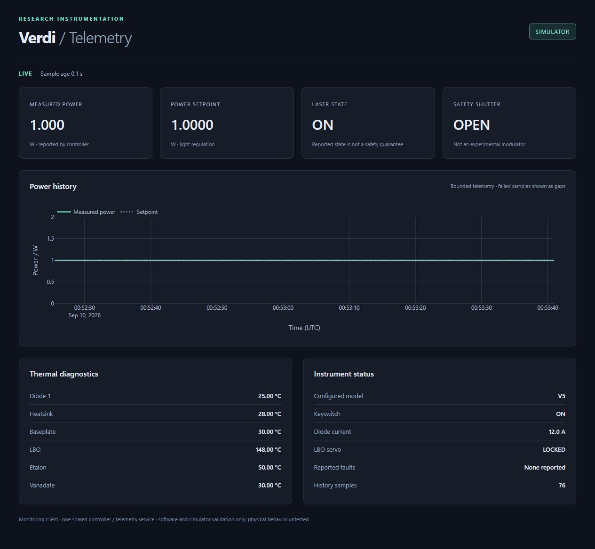
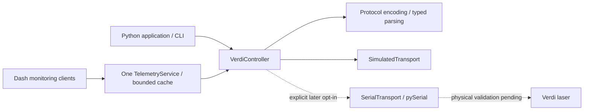

# Coherent Verdi Control

A typed Python controller for Coherent Verdi V-2/V-5/V-6 lasers, with an in-memory
simulator, diagnostics, bounded telemetry, CLI and optional Plotly Dash monitor.
The RS-232 interface follows the supplied Coherent operator manual, Rev IB.

[API reference](docs/API.md) · [Lab integration](docs/INTEGRATION.md) ·
[Simulator behavior](docs/SIMULATOR.md) · [Later hardware validation](HARDWARE_VALIDATION.md)

**New to Verdi?** Start with the [four simulator tutorials](examples/tutorials/README.md):
read status, set power in standby, run one controlled session, and diagnose faults
or lost replies. Each has a self-contained Jupyter notebook with all demonstration
functions laid out in short, named sections. The terminal equivalents share one
[Python file](examples/tutorials/run_tutorial.py) with direct function calls.
An implemented [operator runner](examples/tutorials/README.md#human-operated-hardware)
and optional notebook cells support explicit human-operated serial sessions after
hardware review; simulator mode remains the default and the only development/test mode.

**Hardware-free candidate.** Software and simulator results are recorded in
[STATE.md](STATE.md) and [the engineering report](outputs/REPORT.md). Physical
Verdi behavior, wiring, latency and calibration remain **UNTESTED**. No serial
ports were enumerated or opened during development.

## Install

Python **3.11 or later**. From this checkout:

```sh
python -m venv .venv
# Windows PowerShell:
.\.venv\Scripts\Activate.ps1
# macOS/Linux: source .venv/bin/activate
python -m pip install -e .
```

The core API and simulator have no third-party runtime dependencies. Install
optional capabilities only when needed:

```sh
python -m pip install -e ".[gui]"            # Dash (includes Plotly)
python -m pip install -e ".[serial]"         # Adapter dependency, no connection
python -m pip install -e ".[tutorials]"      # Jupyter notebooks, simulator only
python -m pip install -e ".[dev,serial,gui]" # Development and adapter testing
```

Installing the serial extra does not access hardware. The physical adapter
requires explicit opt-in and later candidate approval; this phase's CLI exposes
no physical connection option. A built wheel can be installed with
`python -m pip install dist/coherent_verdi_control-0.1.0-py3-none-any.whl`.
For a non-editable installation from this checkout, use `python -m pip install .`
or `python -m pip install ".[gui]"`. These instructions do not assume a published
PyPI release. Python 3.11–3.13 are covered by the declared CI matrix.

## Quick start: Python

```python
from coherent_verdi import ControllerConfig, Model, SimulatedTransport, VerdiController

with VerdiController(SimulatedTransport(Model.V5), ControllerConfig(Model.V5)) as laser:
    status = laser.status()
    print(status.model, status.laser_state.name, status.power_w, "W")
    print(laser.diagnostics().software_version)  # SIMULATOR-0.1
```

Construction, close, status polling and transport replacement send no state-changing
commands. Writes are disabled by default. A complete simulated control session:

```python
from coherent_verdi import ControllerConfig, Model, SimulatedTransport, VerdiController

sim = SimulatedTransport(Model.V2)
sim.set_key(True)  # Local fixture only: the real keyswitch has no remote command.
with VerdiController(
    sim, ControllerConfig(Model.V2, allow_writes=True, power_limit_w=0.5)
) as laser:
    laser.set_power_w(0.25)
    laser.enable_laser()  # Explicit action; LASER ON also clears fault history.
    laser.set_shutter(open=True)
    print(laser.power_w(), "W")
    laser.set_shutter(open=False)
    laser.standby()
```

The Verdi head shutter is a **safety shutter**, not an experiment modulation
mechanism. Closing a Python context only releases communication; it does not
change laser, shutter or heater state. See [integration and lifecycle details](docs/INTEGRATION.md).

The default simulator is already warm. To test cold-start handling without
waiting in real time, inject a clock:

```python
from coherent_verdi import ControllerConfig, Model, SimulatedTransport, VerdiController

now = [0.0]
sim = SimulatedTransport(Model.V5, clock=lambda: now[0], warmup_s=60)
with VerdiController(sim, ControllerConfig(Model.V5)) as laser:
    sim.set_key(True)
    print(laser.faults())  # Fault 5: LBO not locked at set temperature
    now[0] = 60.0
    print(laser.status().lbo_servo.name)  # LOCKED
    # This fixture requires a separate explicit enable after readiness.
```

Warmup duration and post-warmup fault latching here are test policies, not firmware
timing claims. See the simulator guide for fault injection, malformed responses
and commands applied before a lost acknowledgment.

## CLI

Every CLI invocation uses a fresh in-memory simulator, emits `simulated: true`,
and loses its simulated settings on exit. Global options precede the subcommand.

```sh
verdi status
verdi --model V6 diagnostics
verdi query '?LBOT'
verdi --allow-writes set-power 0.5
verdi --demo status
verdi --demo watch --count 5 --interval 0.1
```

`--demo` explicitly prepares a 1 W simulated ON/open-shutter fixture. It never
opens hardware. Without it, the fake starts in STANDBY with key OFF and shutter
closed. `watch` flushes each JSON Lines sample immediately for pipeline consumers
and exits with code 2 if any sample failed. Command errors use JSON on stderr and
exit code 2; failed watch samples remain visible in the JSON Lines output.
The Python module form is also available: `python -m coherent_verdi status`.
Use the Python API for a persistent multi-command session.

## Optional Dash monitor

```sh
verdi --demo gui
```

Open [localhost:8050](http://127.0.0.1:8050/). Stop with Ctrl+C. The GUI is a
read-only client of the library's single telemetry service. It has no protocol
implementation, serial handle, device-write callbacks or independent polling
worker. Its immutable cache snapshots remain responsive during slow serial reads,
track source identity per sample, and use monotonic time for freshness. Multiple
tabs read the same bounded history. Failed samples create chart
gaps, and current-state fields become UNKNOWN; old samples are marked STALE.
A browser watchdog also warns after 10 seconds without server updates, so a
disconnected browser does not retain an apparently LIVE monitoring display.



This screenshot was captured from the running simulator. Synthetic values are
not measurements of a physical laser. For embedding, use
`coherent_verdi.gui.create_app(telemetry)` and retain lifecycle ownership in your
application. The CLI binds loopback with debug/reloader off. See the
[integration guide](docs/INTEGRATION.md#dash-deployment) for deployment boundaries.
The [server-loss screenshot](docs/images/simulator-server-offline.png) shows the
independent stale-data warning after stopping the simulator web server.

## Architecture



- All 42 manual queries have source-page references. Routine commands cover
  power, STANDBY/ON, shutter, echo and prompt; service operations are not exposed.
- Immutable models carry W, A, °C, hours, timestamp and sample duration explicitly.
- Per-controller and per-transport locks serialize complete request/reply pairs.
  Compound snapshots also exclude interleaved writes from this controller.
- Finite input checks and 2/5/6 W conservative software ceilings protect against
  malformed setpoints. Caller ceilings can be lower; these are not physical safeguards.
- Bounded I/O, explicit exceptions and failure-aware telemetry keep communication
  problems visible. Timeouts never cause automatic retries or laser enable.

## Verification and examples

```sh
python -m pip install -e ".[dev,serial,gui]"
python scripts/validate.py
python examples/simulated_session.py
python examples/async_integration.py
```

The validation script runs pytest with coverage, lint, formatting, strict typing,
package builds, examples, dependency consistency, source/input checks, source
archive completeness, an isolated wheel-install smoke test and the JavaScript
watchdog regression. One clean environment first checks the dependency-free core,
then installs GUI/serial extras and checks Dash HTTP callbacks and packaged assets.
It also executes all four tutorial notebooks in fresh hardware-guarded kernels,
checks every notebook function against the terminal equivalent, and runs all four
terminal lessons against the installed core wheel. Executed notebook copies are
saved in `records/tutorial-notebooks/`.
The extras check needs access to the configured pip registry
or its cache. Node.js 22 or later must be on PATH; `VERDI_NODE` may name an
explicit Node executable. Results and source hashes go to
`records/validation.json`, `records/validation.log` and `records/junit.xml`.
Only the current JSON manifest is versioned; logs/XML are generated locally and
CI runs this same validator and publishes its evidence as artifacts.
Tests prohibit real serial opens and discovery; adapter tests inject byte streams.
The CI workflow declares Windows/Linux and Python 3.11–3.13; only environments
actually run have PASS evidence. Current tested versions are in
[requirements-validated.txt](records/requirements-validated.txt).
Run `node scripts/test_watchdog.cjs` to check only the browser watchdog with a
virtual clock (no npm packages required).

## Troubleshooting and limits

| Symptom | Response |
| --- | --- |
| `WritesDisabled` | Use explicit write-enabled configuration for an authorized session; simulator CLI needs `--allow-writes`. |
| `ResponseTimeout` / `TransportError` | Outcome may be unknown. No automatic replay; a serial session is unusable after failure. |
| `ProtocolError` | Preserve raw reply, check the exact manual/firmware. Do not turn malformed data into a nominal state. |
| `ConnectionUnusable` | Explicitly prepare a fresh transport; connection recovery must not replay settings or enable the laser. |
| GUI ERROR or STALE | Check sample errors/age and service lifecycle. A displayed historical value is not current physical state. |
| Telemetry `stop()` timeout | Keep the controller open; let the in-flight operation finish, then retry stopping with a suitable timeout. |
| Simulator fault 5 during warmup | Advance the fixture clock to readiness before explicitly enabling. Do not implement automatic enable as recovery. |
| Missing `dash` or `serial` module | Install the relevant optional extra in the interpreter running the application. |
| Model mismatch | Select the model from verified identity. The manual contains no documented model-discovery query. |

The simulator is a software test fixture, not a physical plant model. Active
no-fault `?F` formatting, actual echo framing, firmware timing, shutter-closed
power reporting and calibration require later observation. Unknown fault codes
are preserved. The GUI is monitoring-only; advanced service/calibration commands
are outside this version's operational API. Read the
[protocol contract and uncertainty register](docs/PROTOCOL.md),
[simulator contract](docs/SIMULATOR.md), and
[later hardware-validation procedure](HARDWARE_VALIDATION.md).

## Autonomous engineering workspace

This repository uses [cct1123/agentic-engineering-template](https://github.com/cct1123/agentic-engineering-template),
pinned to `724a7f772069d3357ea66dbc4742d25bd874a33e`. Upstream was not modified.
[Provenance and preserved-file hashes](records/FRAMEWORK.md) are recorded locally.

`PROJECT.md` captures intent, `AGENTS.md` operating instructions, `ARCHITECTURE.md`
the engineering process, `STATE.md` the current checkpoint,
`records/RECORDS.md` evidence/decisions, and `outputs/REPORT.md` the candidate review.
Resume by reading PROJECT.md, AGENTS.md and STATE.md and following the current
inspect → gap → design → implement → test → diagnose loop. At the recorded review
gate, remain hardware-free until explicit candidate approval. These files retain
state; they do not schedule or keep an agent running after a session ends.
