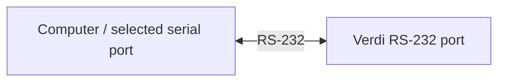

# Coherent Verdi Control

A Python controller for **Coherent Verdi V-2, V-5 and V-6 lasers over RS-232**.
Read power, temperatures and faults; set power; and operate laser standby/enable
and the safety shutter from a terminal, notebook or experiment script.

**Install → Configure the serial link → Read the instrument → Use approved controls**

[Install](#1-install-and-check-the-software) · [Connect](#2-prepare-your-laser-and-serial-link) ·
[Read status](#4-read-status-and-faults) · [Set power](#5-set-power-or-run-a-controlled-session) ·
[Python](#6-use-your-laser-from-python) · [Troubleshooting](#troubleshooting)

## Current status

**Version 0.3.0: software-complete; hardware integration awaits human review.**

| Available now | Validation |
| --- | --- |
| Serial driver, Python API, operator terminal tools and notebooks | Tested with simulated devices and fake serial connections |
| Simulator and optional monitoring dashboard | Software-tested |
| Real V-2 / V-5 / V-6 communication, optical behavior and calibration | **UNTESTED** |

The latest recorded full software run passed **322 tests, 97% coverage**
(Windows / Python 3.12.14). See the [report](outputs/REPORT.md).
Before physical connection, complete the [candidate review and hardware procedure](HARDWARE_VALIDATION.md).
The instructions below prepare an approved, attended lab session.

## 1. Install and check the software

You need **Python 3.11+** and **Git**. In **Windows PowerShell**:

```powershell
git clone https://github.com/cct1123/coherent-verdi-control.git
cd coherent-verdi-control
python -m venv .venv
.\.venv\Scripts\Activate.ps1
python -m pip install -e ".[serial]"
python -m coherent_verdi status
```

The last command checks the installation **using simulation**. Expect JSON with
`"simulated": true`, `"power_w": 0.0` and `"faults": []`. It opens no serial port.

<details>
<summary>macOS / Linux installation</summary>

```sh
git clone https://github.com/cct1123/coherent-verdi-control.git
cd coherent-verdi-control
python3 -m venv .venv
source .venv/bin/activate
python -m pip install -e ".[serial]"
python -m coherent_verdi status
```

The reusable terminal settings below use PowerShell syntax. For other shells,
use the [full command templates](examples/tutorials/README.md#human-operated-hardware)
or the Python example below.

</details>

Already have the checkout? Skip clone and open its folder. Run subsequent commands
from that folder with this environment active.

## 2. Prepare your laser and serial link

Have the operator confirm the actual instrument, cooling, interlocks, enclosed
beam path/termination and physical abort procedure. Record approval for the
candidate and **read-only connection first**; writes are a separate review stage.



| Check | Setting |
| --- | --- |
| Model | V-2 → `V2`; V-5 → `V5`; V-6 → `V6`. The software does not discover the model. |
| Port and cable | Operator-identified native serial port. Verify cable pinout/DCE orientation against manual Figure 5-1. |
| Serial format | 8 data bits, no parity, 1 stop bit (8N1); no flow control |
| Baud | Match the front panel: 1200, 2400, 4800, 9600, 19200, 38400 or 57600. **19200 is only the factory default.** |
| Transaction timeout | Default **1 s**; the runner accepts `--timeout-s` and Python accepts `timeout_s`. Validate the deadline for the actual link; it is not a firmware timing guarantee. |
| Connection owner | Close competing serial clients. One controller owns the connection. |

Use the supplied [operator manual](verdi.manual_v5.pdf), part 0171-750-00 Rev IB,
and your lab's procedure. No port discovery, auto-baud or automatic setup is provided.

## 3. Identify the instrument first

In **PowerShell**, replace every `<...>` below with the verified settings.
`$verdiLink` stores the connection arguments for subsequent commands. Keep using
this terminal; recreate the settings if you open a new one:

```powershell
$verdiLink = @("--hardware", "--port", "<PORT>", "--model", "<MODEL>", "--baudrate", "<BAUD>")
python examples/tutorials/run_tutorial.py read-status @verdiLink --identify-only
```

The runner asks you to type **`CONNECT`**, opens that port without initialization
commands, sends **one `?SV` software-version query**, prints the parsed version and
disconnects. Compare it with the reviewed configuration; follow Stage 1 for raw
framing/version evidence capture. `?SV` does not identify the model.

**Unexpected reply or timeout? Stop here.** Follow the operator's abort procedure;
do not repeatedly reconnect or probe other ports. The confirmation prompt verifies
intent; candidate/site approval must already exist.

## 4. Read status and faults

First finish Stage 1's read validation. It must independently establish the
firmware's exact **no-active-fault `?F` reply**. The simulator uses `SYSTEM OK`,
but the manual specifies that text only for fault history; do not assume it for
your laser.

Add the verified text to the settings in the same PowerShell terminal, then run
a read-only session:

```powershell
$verdiSession = $verdiLink + @("--active-fault-clear-reply", "<VERIFIED_TEXT>")
python examples/tutorials/run_tutorial.py read-status @verdiSession
```

Type **`CONNECT`** for the version query, then **`RUN`** after checking the displayed
device/version and planned operation. Any other answer cancels that stage.

| Readout | Meaning |
| --- | --- |
| Laser state | `0` standby, `1` on, `2` fault |
| Power / setpoint | Reported output / requested setting, in watts |
| Key / shutter | Reported on/off and open/closed state |
| Temperatures / hours | Degrees Celsius / operating hours |
| Faults / history | Active and historical integer fault codes; unknown codes remain visible |

For just the fault report, using the same approved settings:

```powershell
python examples/tutorials/run_tutorial.py faults @verdiSession
```

Both commands query the real instrument with writes disabled, then disconnect.
They do not inject or clear faults. Actual readings must be checked against the
front panel; there are no verified hardware example values yet.

## 5. Set power or run a controlled session

**Proceed only after Stage 1 passes and Stage 2 approves the exact actions,
power ceiling, beam conditions and abort procedure.** Replace the watt placeholders
with the site's approved values. Model software ceilings are **V2: 2 W, V5: 5 W,
V6: 6 W**; they do not establish safe lab limits or verified firmware ranges.

### Change the setpoint while staying in standby

```powershell
python examples/tutorials/run_tutorial.py set-power @verdiSession --target-w "<TARGET_W>" --power-limit-w "<CEILING_W>"
```

Requires standby, shutter closed and no active faults. After `CONNECT` and `RUN`,
the runner sets power and checks readback. It does **not** enable the laser or open
the shutter. **The new setpoint remains stored** after the session; it is not
automatically restored to zero.

### Perform one enable–shutter–standby sequence

Use only with approval for laser enable and shutter opening. The lesson requires
key ON with a previously established, approved RS-232 standby override, shutter
closed, no active faults, and diode/LBO/etalon/vanadate temperature servos locked.
A real keyswitch can enable the laser; changing it is an operator action.

```powershell
python examples/tutorials/run_tutorial.py controlled-session @verdiSession --target-w "<TARGET_W>" --power-limit-w "<CEILING_W>"
```

Normal sequence: **check readiness/history → set power → enable → open shutter
once → read power → close shutter → verify standby**. The target stays stored.
The immediate power sample does not prove optical settling or calibration.
On a failure, the runner stops further commands; it cannot guarantee shutdown.

### Prefer notebooks?

```sh
python -m pip install -e ".[serial,tutorials]"
python -m jupyterlab examples/tutorials
```

Choose this environment's kernel. Each [notebook](examples/tutorials/README.md#human-operated-hardware)
has a hardware section with port/model/baud and verified fault-clear text; write
lessons also require target/ceiling. Hardware execution defaults to disabled.
Notebook 1 defaults to identification only. Enable only the approved session,
then return `RUN_HARDWARE` to `False`.

## 6. Use your laser from Python

After Stage 1 validates these reads, save this as `read_verdi.py`. Replace the
three placeholders with the same verified settings, then run `python read_verdi.py`:

```python
from coherent_verdi import VerdiController

PORT = "<PORT>"
MODEL = "<MODEL>"  # V2, V5 or V6
BAUDRATE = int("<BAUD>")

with VerdiController(PORT, model=MODEL, baudrate=BAUDRATE) as laser:
    print("Software:", laser.read("?SV"))
    print(f"Power: {laser.read_power_w():.3f} W")
    print(f"LBO temperature: {laser.read('?LBOT'):.2f} °C")
    print("Laser state:", laser.read_laser_state())
```

Writes are disabled by default. `with` opens the port and releases it on exit;
**it does not shut down the laser**. This example needs no fault-clear setting
because it does not read `?F`. For `status()` or `read_faults()`, configure
`active_fault_clear_reply` with the independently verified text.

The [Python API](docs/API.md) documents `set_power_w()`, `start()`, `stop()`
and `set_shutter(open=...)`. Approved write sessions need `allow_writes=True`
and a site-approved `power_limit_w`; these methods do not replace the readiness
checks shown in the operator lessons.

## End a session safely

- **`disconnect()` only closes communication.** Exiting a notebook/script or
  pressing Ctrl+C does not shut down the laser.
- **`stop()` means standby.** Temperature servos remain powered. Full shutdown
  follows the manual's LBO cool-down procedure; do not power-cycle to fix communication.
- **`start()` also resets faults and clears history.** Capture history first;
  never use repeated enable commands as fault recovery.
- **A missing reply can follow an executed write.** Stop commands, retire the failed
  session and follow the physical abort procedure. There is no automatic reconnect,
  retry or replay, and no blind cleanup writes.
- **Use the head shutter only as a safety shutter.** Never cycle it for modulation.
  The software/dashboard do not replace hardware interlocks.

## Troubleshooting

| Symptom | Next step |
| --- | --- |
| Output says `SIMULATOR` | All `python -m coherent_verdi` commands are simulator-only. Use the operator runner with `--hardware`, or `VerdiController`. |
| Serial connection will not open | Check the configured port, adapter/driver and competing clients with the operator. Do not scan by opening ports. |
| Timeout, malformed reply or failed session | Stop commands. Review cable and front-panel baud under Stage 1; establish an approved clean connection before a new session. |
| `invalid fault list` for a clear-looking reply | Verify the exact `?F` clear response and its meaning; configure it for a new approved session. Do not assume `SYSTEM OK`. |
| Writes disabled or setpoint rejected | Check approved write scope and the target/ceiling in watts. Read-only defaults are intentional. |
| Import error / PowerShell activation blocked | Install into the intended environment. You can use `.\.venv\Scripts\python.exe` instead of `python` without activation. |

## Optional: practice and preview without a laser

The simulator uses the same device operations, with synthetic temperatures, power
and fault behavior. It does not establish hardware timing, accuracy or calibration.

```sh
python examples/tutorials/run_tutorial.py set-power
python examples/tutorials/run_tutorial.py controlled-session
python -m pip install -e ".[gui]"
python -m coherent_verdi gui
```

Open **[http://127.0.0.1:8050](http://127.0.0.1:8050/)**; Ctrl+C stops this simulator
dashboard. If the port is busy, run `python -m coherent_verdi gui --port 8051`
and open [port 8051](http://127.0.0.1:8051/).


*Dashboard screenshot with synthetic V5 readings. It is monitoring-only.
The CLI starts a fresh standby simulator, so 0 W is expected; separate tutorial
runs do not feed this view. LIVE describes sample freshness, not safety.*

**For a hardware dashboard**, an application must connect `VerdiController`,
schedule `Monitor.poll_once()` and serve `create_app(monitor)`; the CLI has no
hardware GUI option. See [monitoring integration](docs/API.md#optional-monitoring).

## Developer and reference notes

The application owns connection lifetime, polling and logging. Share one controller;
it serializes I/O. `status()` combines 14 sequential reads, not simultaneous measurements.

| Reference | Contents |
| --- | --- |
| [Tutorials](examples/tutorials/README.md) | Complete terminal templates, notebooks and expected sequences |
| [API](docs/API.md) / [architecture](ARCHITECTURE.md) | Interfaces, migration and integration |
| [Protocol](docs/PROTOCOL.md) / [simulator](docs/SIMULATOR.md) | Manual mappings, firmware uncertainties and fixture limits |
| [Hardware procedure](HARDWARE_VALIDATION.md) / [report](outputs/REPORT.md) | Review stages, physical tests, shutdown and validation evidence |

Full hardware-free software validation, from the activated environment:

```sh
python -m pip install -e ".[dev,serial,gui]"
python scripts/validate.py
```

Requires Node.js for the watchdog check (`VERDI_NODE` may specify its path).
Installation checks use pip's registry/cache. Results go to
`records/validation.json`; physical validation remains separate.
