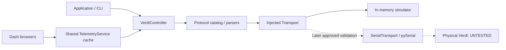

# Integration guide

## Ownership and concurrency

Use one `VerdiController` per physical connection and share it among clients.
The controller serializes all transactions and holds its lock over `status()`
and `diagnostics()` query groups. A status sample is 14 sequential reads; its UTC
timestamp marks the start and `duration_s` records elapsed sampling time. External
hardware/front-panel changes can still occur between queries.

The controller owns its transport. The telemetry service owns its worker and
does not own the controller. Dash owns neither. Shutdown in that order: stop
the worker, then close the controller. Communication close issues no device
commands. A surrounding application must separately implement its authorized
hardware shutdown policy.



## API and errors

The core library has no third-party runtime dependencies and provides type hints
plus `py.typed`. `ControllerConfig` and returned dataclasses are immutable.
Use enum `Model.V2`, `.V5`, or `.V6`; the manual provides no automatic model query.
Set a lower `power_limit_w` to enforce a site-specific software ceiling.

- `status()` gives laser/key/shutter states, W, A, °C, LBO servo and active faults.
- `diagnostics()` gives software version, component operating hours and fault history.
- `query(Query.X)` provides all documented reads. Return types follow the catalog;
  unspecified-unit/composite responses stay strings. Unknown positive faults stay visible.
- `set_power_w`, `standby`, `enable_laser`, `set_shutter`, `set_echo` and `set_prompt`
  are explicit operations requiring `allow_writes=True`. Setpoint rounding is
  four decimal places and both input and rounded values must respect the ceiling.

Catch `VerdiError` at the application boundary. `DeviceError` retains the
instruction and device reply. `ResponseTimeout`/`TransportError` mean that an
operation may already have taken effect. `ProtocolError` means malformed or
unsupported data; it is never converted to a nominal state. `ConnectionUnusable`
requires explicit replacement. Bad local inputs raise `ValueError` before I/O;
disabled writes raise `WritesDisabled`. Automatic retries are intentionally absent.

`replace_transport(fresh)` closes the old transport and installs a caller-prepared
new one without replaying commands. The caller owns establishing a truly clean
physical session after later authorization. It cannot replace a closed controller.
Do not share one transport among controllers or use it directly alongside its owner.

## Telemetry

```python
from coherent_verdi import ControllerConfig, Model, SimulatedTransport
from coherent_verdi import TelemetryService, VerdiController

with VerdiController(SimulatedTransport(), ControllerConfig(Model.V5)) as controller:
    with TelemetryService(controller, interval_s=1, history_size=600) as telemetry:
        # Application work here. telemetry.history is an immutable cached snapshot.
        # The first sample may still be in progress when this block begins.
        pass
```

`interval_s` is the minimum delay **after** a full sample, not a guaranteed sample
frequency. There are no catch-up bursts. Failed samples have `status=None`, an
error message and exception type. Consumers must check those fields and sample
age; no last-good value is represented as fresh after failure. History size is
bounded. The library logs telemetry errors to `coherent_verdi.telemetry` without
configuring the application's logging handlers.

`stop()` waits up to 30 s by default. If an injected/custom transport exceeds
that bound it raises `TimeoutError` instead of claiming the thread stopped.
The serial adapter's per-transaction default is 1 s; longer caller-configured
timeouts require an appropriate stop budget (14 queries per status sample).
All custom transports must provide bounded I/O and exclusive request/reply ownership.

For async applications, see [async_integration.py](../examples/async_integration.py).
`asyncio.to_thread` prevents blocking the event loop. Canceling the awaiting task
does not cancel an in-flight serial command; await/drain outstanding work before
closing the controller. Never interpret cancellation as a physical stop.

## Dash deployment

`create_app(telemetry)` constructs a read-only monitoring app. Its callbacks only
read cached telemetry and cannot control the laser. The owner starts/stops the
service. Multiple browser tabs share the same cache and cause no new device queries.

The CLI serves localhost with debug/reloader disabled. For a larger deployment,
provide authentication through the existing stack, retain one process owning the
controller, and expose snapshots through your application boundary if using
multiple web workers. Do not construct one hardware owner per WSGI worker.
The optional GUI is not an access-control or safety system.

A local browser watchdog marks all displayed data stale after 10 seconds without
a server callback, including when the server itself stops. It uses browser
monotonic receipt time and makes no device or network queries. If the browser/OS
is suspended, the warning can only update once browser execution resumes.
Reload browser tabs after upgrading the application, so the layout and callback
definitions match the running server version.
